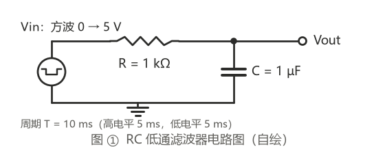
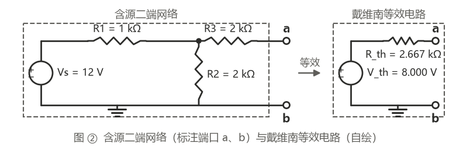
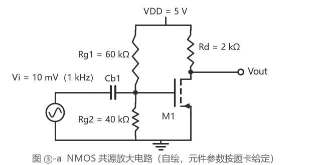
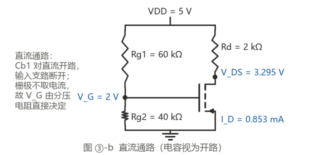
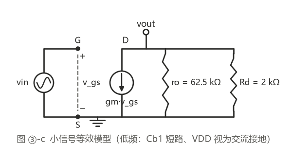
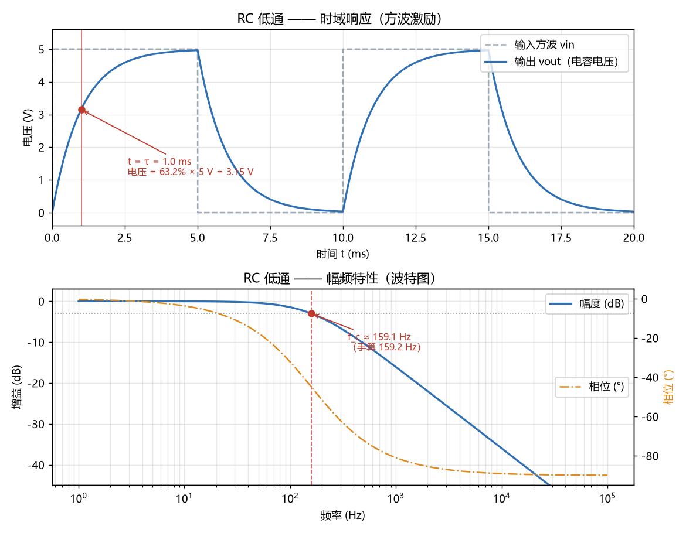
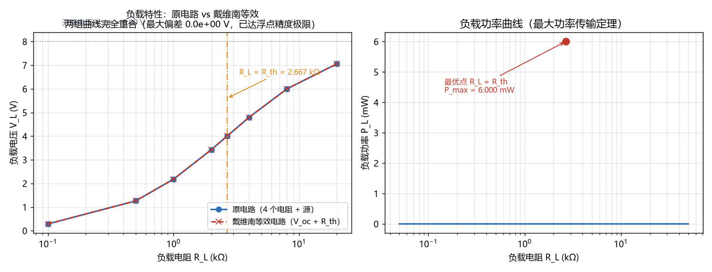
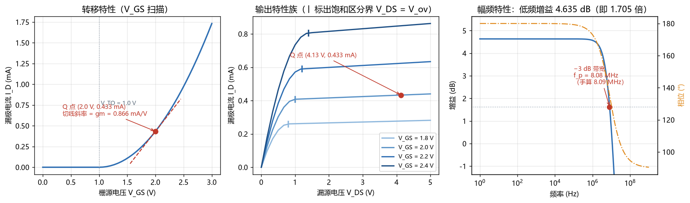
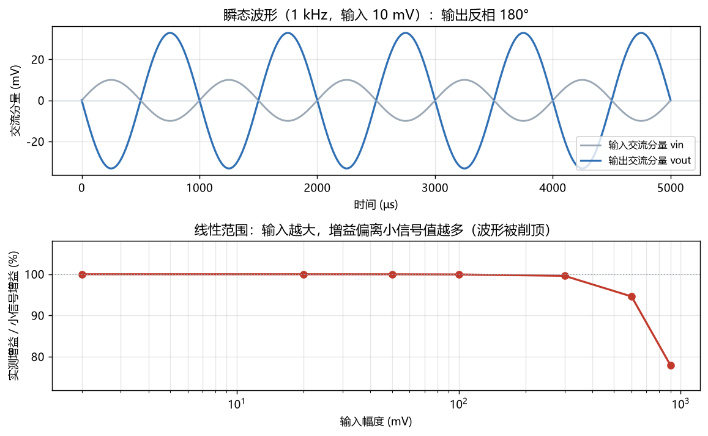

# 新兵任务 · 闫心语

广东工业大学 · 集成电路设计与集成系统 · 大一

本仓库是招新考核的完整交付：**个人主页** + **贪吃蛇小游戏（手动游玩 + AI 自动玩）** + **PySpice 电路仿真**。
  
网页部分零外部依赖、零构建步骤，直接双击 `index.html` 就能打开。

---

## 在线预览

| 页面                | 地址                                                                                                        |
| ----------------- | --------------------------------------------------------------------------------------------------------- |
| 个人主页              | <https://yxyxz-1005.github.io/recruit-task/>                                                              |
| 贪吃蛇游戏             | <https://yxyxz-1005.github.io/recruit-task/game/>                                                         |
| 贪吃蛇单文件版（双击即玩的那份）  | <https://yxyxz-1005.github.io/recruit-task/game/snake-standalone.html>                                    |
| 贪吃蛇 AI 演示（打开即自动玩） | <https://yxyxz-1005.github.io/recruit-task/game/?mode=ai\&speed=25>                                       |
| 个人简介 PDF（网页直链）    | [个人简介.pdf](https://yxyxz-1005.github.io/recruit-task/%E4%B8%AA%E4%BA%BA%E7%AE%80%E4%BB%8B.pdf)            |
| 个人简介 PDF（仓库文件）    | [个人简介.pdf](https://github.com/yxyxz-1005/recruit-task/blob/main/%E4%B8%AA%E4%BA%BA%E7%AE%80%E4%BB%8B.pdf) |

> GitHub Pages 开启方式：仓库 Settings → Pages → Source 选 `Deploy from a branch`，Branch 选 `main` / `root`。
>
> PDF 给了两个入口：`.github.io` 走 Pages CDN，国内打开比 GitHub 的 blob 预览快得多；
  
> blob 那个是仓库原始文件，用来确认文件确实在仓库里。

---

## 目录结构

```
recruit-task/
├── index.html              个人主页（纯 HTML + CSS，零 JS 依赖）
├── 个人简介.pdf             个人简介（已压缩，见文末踩坑记录）
├── game/
│   ├── index.html          贪吃蛇界面层：渲染、键盘与按钮交互
│   ├── snake-core.js       贪吃蛇纯逻辑层：规则 + AI 决策（不碰 DOM）
│   └── snake-standalone.html  单文件交付版（逻辑已内联，双击即开）
├── tools/
│   ├── build-single.js     构建单文件版（把 snake-core.js 内联进 HTML）
│   ├── stress-test.js      AI 压测脚本（Node 运行，输出达标率）
│   ├── inspect-ai.js       逐步打印 AI 的决策过程（讲解 / 排查用）
│   └── browser-smoke-test.js  无头浏览器冒烟测试（零依赖走 CDP）
├── docs/
│   ├── prompt-log.md       AI 提示词迭代记录
│   └── code-notes.md       关键代码逐段讲解（用自己的话）
├── circuit/                进阶挑战：PySpice 电路仿真
│   ├── README.md           电路图、手算过程、完整对比表、11 条踩坑记录
│   ├── spice_env.py        公共引导模块：加载 ngspice 库 + 中文字体 + 对比表输出
│   ├── rc_lowpass.py       电路① RC 低通滤波器
│   ├── thevenin.py         电路② 戴维南等效电路
│   ├── nmos_amp.py         电路③ NMOS 共源放大器
│   ├── draw_schematics.py  画电路图（改成矢量输出，改参数可重跑）
│   ├── *_circuit.png       三个电路的电路图 + 直流通路 + 小信号模型
│   └── *.png               波形图与特性曲线（属交付物，故不忽略）
├── LICENSE                 MIT
└── README.md
```

之所以把游戏切成 `snake-core.js`（逻辑）和 `index.html`（界面）两层：**同一份 AI 算法既能被网页调用，也能被 Node 直接拿去跑批量压测**。所以"AI 成功率 100%"这句话不是我试了几局得出的感受，而是一条可以复现的命令。

---

## 一、个人主页 `index.html`

### 做了什么

- **蓝图网格底纹 + 低饱和蓝灰配色**，整体按"工程图纸"的调性设计
- **纯 CSS 主题切换**：用一个隐藏 `checkbox` 配合同级选择器切换整套 CSS 变量，深浅色切换不依赖任何框架
- **主题记忆**：6 行内联脚本把选择存进 `localStorage`，刷新后不会跳回浅色；主页和游戏页共用同一个键，两页主题联动
- **芯片位号式分区标题**（`U1` `U2` `U3` `U4`，取自 PCB 上集成电路的标号习惯），页脚做了丝印风格
- **零外部资源**：图标全部是内联 SVG（favicon 也是 `data:` URI），断网也能完整显示

### 技术选择说明

主页刻意**不用任何框架**。原因：这个页面只有一屏内容，引入框架带来的收益为零，而纯静态文件在 GitHub Pages 上的加载速度和稳定性最好。

---

## 二、贪吃蛇游戏 `game/`

### 交付形态：为什么有"两个文件"和一个"单文件版"

任务书的作品要求是「纯前端**单文件**（HTML/CSS/JS），浏览器双击即可打开，无框架依赖」。对照下来：

| 文件                           | 用途                     | 双击可开 | 外部引用     |
| ---------------------------- | ---------------------- | ---- | -------- |
| `game/snake-standalone.html` | **交付用单文件版**（逻辑已内联）     | ✅    | 0 个      |
| `game/index.html`            | 开发用界面层（引用下面的逻辑层）       | ✅    | 1 个本地 js |
| `game/snake-core.js`         | 开发用逻辑层（规则 + AI，不碰 DOM） | —    | 0 个      |

拆成两层的唯一目的：**让同一份 AI 算法能被 Node 直接 `require`，从而批量跑几百局压测。**
  
如果 AI 逻辑长在 `index.html` 里，就只能靠人手点着试，"达标率 100%" 这句话也就变成了无法复现的个人感受。

那"单文件"怎么满足？——用构建脚本把逻辑内联回去：

```bash
node tools/build-single.js      # 生成 game/snake-standalone.html
```

生成物**零外部引用**（脚本会断言内联后不再残留 `src="snake-core.js"`），所以它是真正的单文件：
  
拷到任何地方、双击就能玩。源码与交付版**同源**，不会出现"两份代码改一处忘一处"。

### 阶段一：基础可玩版本

- 方向键 / `WASD` 控制，`空格` 暂停或继续，`R` 重开，`M` 切换模式
- **禁止 180° 掉头**：不允许直接反向，否则等于原地撞自己
- **转弯缓冲**：按键先缓存到 `pendingDir`，下一帧才生效，避免一帧内连按两个方向导致穿身
- **撞自身判定的细节**：不吃食物时蛇尾这一帧会让位，所以尾格不算障碍；吃食物时蛇变长、尾巴不动，尾格必须算障碍
- 最高分用 `localStorage` 持久化

**怎么验证**：① **手动实测**——方向键 / `WASD` / `空格` / `R` / `M` 逐条按键试一遍，再分别撞一次墙、撞一次自己，确认都正确判死（这部分依赖"人"操作，无法自动化）；② **无头浏览器冒烟测试**——`node tools/browser-smoke-test.js`，自动检查页面无 JS 报错、canvas 为正方形、指标条不溢出，把"能正常玩"变成一条可复现的命令。

### 阶段二：AI 自动玩

这部分是本次任务的重点。AI 不是"朝着食物走"这么简单——那样在第 5~8 个食物之后就会因为蛇身变长把自己围死。

#### 决策优先级

每一步按下面顺序尝试，取第一个可行的方案：

1. **能吃就吃**：这一步的落点正好是食物，且吃完之后仍然安全 → 吃掉
2. **沿最短路径追击**：用 BFS 算出"离食物还差几步"的距离场，走向距离减 1 的相邻格，且事后安全
3. **追自己的尾巴**：食物暂时吃不到（被自己挡住，或吃它不安全）时，转向自己的尾巴——尾巴会一直往前让位，跟着它就能保住退路
4. **兜底**：连尾巴都追不上时，选事后可达空间最大的方向，尽量多活几步

#### "安全"是怎么定义的

每走一步都要先**模拟走完这一步的棋盘**，然后检查两件事：

- **(a) 从新蛇头出发能走到的空格数 ≥ 蛇长**——还有活路，没把自己围进小圈
- **(b) 新蛇头仍然能找到一条通往新尾巴的路径**——退路还在，不会被自己封死

两条都满足才算"安全"。这就是它不会在第 5~8 个食物翻车的核心原因。（详见 `docs/code-notes.md`）

#### 决策可视化

为了让人看得见"AI 在想什么"，棋盘上额外画了两层信息：

- **虚线**：AI 规划出的路径（追击食物时画到食物的路，追尾时画到尾巴的路）
- **淡色区块**：AI 眼里的活动空间，也就是从蛇头洪水填充出来的可达区域

右侧面板同步显示每一步的文字依据，例如：

```
#240  追击  BFS 最短路径追击 · 距食物 4 步 · 事后可达 378 格
#241  追尾  食物暂不可达 · 转向追尾保住退路 · 事后可达 376 格
#242  吃食  吃掉第 21 个 · 吃完后可达 375 格（蛇长 24）· 仍能回到尾部
```

评审如果问"这个 AI 凭什么不会撞死"，直接看这个面板就够了。

#### 压测结果（真实数据，可复现）

任务书指标：AI 自动玩需要**连续吃满 15 个食物不死**。

命令行版（`node tools/stress-test.js 300`）：

| 局数  | 达标局数（≥15） | 达标率      | 平均得分   | 最高分 |
| --- | --------- | -------- | ------ | --- |
| 100 | 100       | **100%** | 100.38 | 152 |
| 300 | 300       | **100%** | 97.13  | 155 |

网页版（游戏页点「U3 AI 压测 → 跑 30 局」）：30 局全部达标，达标率 **100%**，平均得分 107.37。

两处结果一致，因为它们跑的是同一个 `snake-core.js`。

### 新增功能（对照任务书验收标准逐条自查）

任务书给的是一张「新增功能」表（计分制 / 主题切换 / 多局战绩），**至少实现 1 个**。
  
这里三个全部实现，逐条对照验收标准：

| 任务书选项    | 验收标准原文                               | 本项目的落点                                                                                                                   | 达标 |
| -------- | ------------------------------------ | ------------------------------------------------------------------------------------------------------------------------ | -- |
| **计分制**  | 记录得分 / 最高分 / 局数；新一局不清零；有「重置」按钮       | 顶部 HUD 实时显示当前得分与 `目标 15`；最高分、总局数、达标场次等写进 `localStorage`，**开新一局只累加、不清零**；面板里的「清空战绩」按钮就是重置                                 | ✅  |
| **主题切换** | 至少 2 套配色（深色 / 浅色）；一键切换即时生效；刷新后保留所选主题 | 浅色 / 深色两套完整配色，右上角一键切换；切换时**立刻重绘画布**，所以 canvas 里的颜色也即时跟着变；选择写入 `localStorage`（键 `yx-theme`），**刷新后保留**，并与个人主页共用同一个键、两页主题联动 | ✅  |
| **多局战绩** | 记录最近 10 局结果；新一局自动追加；可查看完整列表          | 每局结束自动追加一条（得分 / 步数 / 是否达标）；面板汇总总场次、达标场次、达标率、平均分、历史最佳、最高步数，外加**最近 12 局**的迷你柱状图（超过任务书要求的 10 局），完整列表可滚动查看                   | ✅  |

另外还顺手做了两件任务书没要求的：**速度档位**（慢 / 中 / 快 / 极速）+ 暂停、重开；
  
**AI 死后自动续局**（勾选后可以放着让它连续跑，直观看出稳定性）。

还有一个可以直接发给别人的演示链接参数：`?mode=ai&speed=25` —— 打开就自动进入 AI 演示。

---

## 三、进阶挑战：PySpice 电路仿真 `circuit/`

选了 PySpice 而不是 CROC 论文，理由：本专业是集成电路设计与集成系统，SPICE 是本行工具；而 CROC 那条路要 Verilator + Yosys，Windows 下得靠 WSL，环境风险太高。

三个电路，每个都按 **画电路图 → 手算 → 仿真 → 对比 → 误差分析** 五步做，不是"跑出波形就算完成"：

| # | 电路          | 验证内容                      | 手算 vs 仿真    |
| - | ----------- | ------------------------- | ----------- |
| 1 | RC 低通滤波器    | 时间常数 τ、截止频率 f_c、充放电过程     | 误差 < 1%     |
| 2 | 戴维南等效       | V_oc、R_th（三种方法互证）、接负载逐项验证 | 误差 < 0.001% |
| 3 | NMOS 共源放大电路 | 饱和区判据、gm、ro、Av、带宽         | 误差 < 0.15%  |

**几个值得说的点：**

- **戴维南的 R_th 用三条互相独立的路径求**：`V_oc ÷ I_sc`、独立源置零后注入 1 A 测试电流、接已知负载反推。三者吻合到 0.0004%。再把原电路和等效电路分别接 8 组不同负载，端电压差落在浮点精度极限（10⁻¹⁰ V 量级）——这说明在线性电路里戴维南等效是精确关系式而非近似。
- **NMOS 手算做了两套**：理想平方律、含沟道长度调制。前者的 I_D、gm、|Av| 三项偏差**都是同一个 6.59%**，等于直接指出"漏了一项修正"；补上 λ 后误差降到 0.13% 以内。
- **两条完全独立的技术路线交叉验证**：交流分析（频域线性化）给出增益 3.3051，瞬态分析（时域数值积分）给出 3.305。数学上完全不同的两件事给出同一个数，这是仿真结果可信的最强证据。
- **一处反直觉的公式**：`ro = 1/(λ·I_D0)` 用的是不含 λ 的基准电流，不是含 λ 修正后的实际电流——下标差一个，结果差 6.6%。
- **参数必须照着题卡抠**：第一版我把 NMOS 的 `K` 随手取成了 0.4 mA/V²，而题卡写的是 0.8 mA/V²，整组数据差了一倍，而且**脚本不报任何错**。现在脚本里加了断言来防这件事。
- **每个电路都画了电路图**（任务书要求"自己画的电路图"）：RC 低通、含源二端网络（标注端口 a/b）、NMOS 共源电路，另外第③题还按要求画了**直流通路**和**小信号等效模型**。

**电路图：**











**仿真波形与数据：**









详细手算过程、完整对比表和 11 条踩坑记录见 **[`circuit/README.md`](circuit/README.md)**。

---

## 四、AI 使用与协作说明

任务书要求标注 AI 参与的部分，并说明"验证的过程"。这里如实交代。

### 哪些是 AI 辅助生成的

| 部分                         | AI 参与程度   | 我的工作                                              |
| -------------------------- | --------- | ------------------------------------------------- |
| 个人主页                       | 结构由 AI 起草 | 修改文案与配色、自己验证断网可用                                  |
| 贪吃蛇阶段一                     | 由 AI 生成   | 实测碰撞判定、补充理解                                       |
| `snake-core.js` 逻辑层与 AI 算法 | 由 AI 生成   | 自己跑 300 局压测验证、定位并理解两处 bug、写出 `docs/code-notes.md` |
| 压测与冒烟测试脚本                  | 由 AI 生成   | 自己运行、核对数据一致性                                      |
| README                     | 与 AI 共同整理 | 补充自己的判断和踩坑记录                                      |

### 我查证后确认 AI 给错的信息 / 代码

任务书要的是"一条 AI 给过、但我查证后确认是错的信息"，这里给三条，按"错得多隐蔽"排序。
  
每一条我都写清了**是怎么发现的**，因为查证过程比结论重要。

**第一条：AI 说 NMOS 的输出电阻是 `ro = 1/(λ·I_D)`（用实际电流）——错了。**

AI 的公式看起来完全合理，代入时还特意用了"含 λ 修正后的实际电流 0.8527 mA"，
  
算出 58.64 kΩ。但仿真是 62.5 kΩ。

我去查了 SPICE level=1 模型的定义才发现问题：

```
I_D  = I_D0 · (1 + λ·V_DS)，其中 I_D0 = K·V_ov²（与 λ 无关）
gds  = ∂I_D/∂V_DS = λ · I_D0        ← 分母是 I_D0，不是 I_D
```

**分母该用不含 λ 的基准电流 0.8 mA。** 1/(0.02 × 0.8m) = 62.5 kΩ，与仿真完全吻合。

发现方式：不是靠"觉得不对"，而是**把仿真值当标准答案反推**——62.5 kΩ 恰好等于
  
用 0.8 mA 算出的值，这个吻合太整齐，不可能是巧合，于是就能精确定位到是分母错了。

**第二条：AI 生成的贪吃蛇 AI 算法，第一版压测 100 局达标率 0%。**

两处错：

1. **距离场方向写反了**：代码从蛇头向外算距离，却拿它判断"相邻格是否离食物更近"。相邻格的距离恒为 1，永远匹配不上食物的距离值，所以它根本没在追食物。正确做法是**从食物出发**做 BFS。
2. **把蛇头也当成了墙**：障碍图里连蛇头一起标成障碍，导致从食物出发的 BFS 永远扩散不到蛇头身上，"离食物还有几步"全部读成 −1，AI 直接失明。蛇头和蛇尾都不该算墙——蛇头下一步就离开，蛇尾这一步就让位。

发现方式：**驱动 AI 按"我想看 AI 每步为什么这么走"的需求实现了一个逐步调试脚本，把 AI 每一步的决策依据打印出来，再自己运行它逐行核对**。
  
第一眼看上去"蛇在动、代码没报错"，光看代码根本看不出问题；
  
把中间量打出来才看到"距食物 −1 步"这种荒谬的值。

改完这两处，达标率从 0% 变成 100%。

**第三条：AI 没读题卡就自己假设了器件参数——差点整组数据作废。**

题卡白纸黑字写着 NMOS 的 `K = 0.8 mA/V²`，AI 却按 `W/L = 4`、`KP = 200 µA/V²`
  
推出等效 `K = 0.4 mA/V²`，**差了一倍**。而且脚本不报任何错：表格照常打印、
  
曲线照常好看，所有结果整齐地错成一半。

发现方式：**拿着题卡逐字对参数**——这是唯一能发现它的方法。
  
现在脚本里留了一行断言防止以后再犯：

```python
assert abs(0.5 * KP * (W / L) - K_TARGET) < 1e-9, "等效 K 与题卡不符"
```

**这三条合起来给我一个共同的教训**：AI 写的东西，语法错误最少，逻辑错误最多；
  
而逻辑错误里，又属"方向反了""下标错了""参数没看题"最难靠肉眼发现。
  
所以我给自己定的规矩是——**任何 AI 给的结论，都要有一个不依赖它的手段去验证**：
  
跑数据、看中间量、对题卡、或者干脆用两条独立方法算同一个数。

这是本项目最重要的一条经验。完整记录见 [`docs/prompt-log.md`](docs/prompt-log.md)。

### 提示词记录：关键提示词（原文）与迭代

任务书要求 README 里"附上你给 AI 的关键提示词（原文 + 每次迭代：想让 AI 做什么 → 结果如何 → 提示词怎么改）"。
  
下面把最关键的三轮原文摘出来，完整六轮记录见 [`docs/prompt-log.md`](docs/prompt-log.md)。

**第 1 轮 · 个人主页（提示词原文）**

> 我是集成电路设计与集成系统专业的大一新生，我想做一个个人主页，只用 HTML 和 CSS，不引入任何框架和外部资源。配色希望低饱和、偏理工科的蓝灰色，整体有"工程图纸"的感觉。要有关于我、兴趣爱好、联系方式三个区块。

→ **结果**：结构完整、零外部依赖，但标题没辨识度、刷新会跳回浅色。
  
→ **改法**：标题换成 PCB 位号风格（`U1` / `U2` / `U3`），并补 6 行内联脚本把主题写进 `localStorage`、与游戏页共用同一个键。

**第 3 轮 · 贪吃蛇 AI（提示词原文，最关键的一轮）**

> 让 AI 自动玩，指标是**连续吃满 15 个食物不死**。我明确要求不能只做"每次朝最近的食物走"。

→ **结果**：首版跑 100 局，**达标率 0%**，平均 0.38 分。
  
→ **改法**：**不重写、先查证** —— 驱动 AI 生成逐步打印脚本，自己运行后看到 AI 一直在"兜底 / 追尾"、从不追食物，从而定位到两个 bug（BFS 距离场方向算反、蛇头被错当成墙）。改完 **0% → 100%**。

**第 6 轮 · 三电路"手算 vs 仿真"（提示词原文）**

> 我要用 PySpice 做三个电路……每个都要**先手算、再仿真、然后把两者对起来看差多少**。我不想要那种"跑出波形就算完成"的效果，我要的是偏差能被解释清楚。特别强调两点：一是戴维南的等效电阻要用多种方法互相印证，二是 MOS 那部分我电路零基础，公式和判断依据都要讲清楚。

→ **结果**：首版 NMOS 与手算差 6.59%。
  
→ **改法**：让它**同时输出两套手算**（理想平方律 + 含沟道长度调制）。三项偏差同为 6.59%，恰好指出"漏了 λ 这一项修正"。

关键代码逐段讲解见 [`docs/code-notes.md`](docs/code-notes.md)。

---

## 五、工程素养清单

- [x] 公开仓库，代码可访问
- [x] `MIT LICENSE`
- [x] `.gitignore`（区分开"要提交的成果"和"临时产物"）
- [x] 目录分层：`game/` 逻辑与界面分离，`circuit/` 放仿真，`docs/` 放文档
- [x] 语义化提交信息（`feat:` / `fix:` / `docs:` / `chore:`）
- [x] 真实创建分支并合并（见提交历史）
- [x] GitHub Pages 部署
- [x] 开启两步验证（2FA）：使用验证器 App（TOTP，Authy）扫码绑定，恢复码已离线保存


### 什么是"分支"和"合并"

用一句话说：**分支就是在主线的某个提交上贴的一张便利贴，合并就是把便利贴指着的那串提交并回主线。**

主线上（`main`）是随时能交的状态；要试新东西就开一条分支（本项目的 `feat/ai-autoplay`、`feat/circuit-simulation` 都是这样开的），
  
在分支上怎么写坏都不影响主线，写好了再合并回来。这样"主线永远可用"和"敢做实验"这两件事就不冲突了。

分支不是"把项目复制一份"——老式工具（如 SVN）才会真的复制目录，又慢又占空间。Git 里一个分支就是一个 **41 字节的小文件**，
  
内容只有一串 commit 哈希；而每个提交里都记着它的**父提交**是谁。所以提交历史本来就是一张网，
  
"分支"只是贴在某个节点上的一张标签，贴上、挪走，成本几乎为零——这才是 Git 敢让人随便开分支的原因。

本项目真的走了一遍这个流程，提交历史里能看到分叉和汇合：

```
*   f04055a Merge branch 'feat/circuit-simulation'     ← 合并提交（两个父提交）
|\
| * 0622a8f docs: 补充电路部分的手算记录
| * 825de69 feat(circuit): 进阶挑战 —— PySpice 三电路仿真
|/
* 7107ab9 docs: README 补充个人简介 PDF 入口            ← 分叉点（共同祖先）
```

合并不是"把分支的文件盖过来"，而是**三方比对**：如果 `main` 在分叉之后一直没动，Git 只需把标签平移过去（**快进**，不产生新提交）；
  
两边都有新提交时，就必须造一个**合并提交**——它破例有**两个父提交**，上面的 `f04055a` 就是这种。
  
Git 会拿两条线最近的**共同祖先**（这里是 `7107ab9`）当基准，分别算出"祖先→主线改了什么"和"祖先→分支改了什么"再叠加。
  
只有当**同一行被两边各改了一次**时，Git 才不敢替人做决定，会在文件里留下 `<<<<<<<` / `=======` / `>>>>>>>` 三个标记；
  
手工改成想要的样子，再 `git add` + `git commit` 就算解完冲突——所以冲突不是报错，是"这里需要人的判断"。

用到的命令一共四条：

```
git switch -c feat/xxx   # 从当前提交处新建一条分支并切过去（旧写法：git checkout -b）
# …在分支上照常 add / commit…
git switch main          # 切回主线：merge 永远在"接收改动的那一方"执行
git merge feat/xxx       # 把分支上的提交并回主线
git branch -d feat/xxx   # 合并完就可以删掉这条分支
```

### 命令行用途

| 命令                   | 用途                                      |
| -------------------- | --------------------------------------- |
| `cd 目录`              | change directory，切换当前所在目录。所有相对路径都以它为准   |
| `ls`                 | list，列出当前目录下的文件（Windows 的 `dir` 是同一个意思） |
| `mkdir 目录名`          | make directory，新建一个目录                   |
| `git init`           | 把一个普通文件夹变成 Git 仓库（生成 `.git`）            |
| `git add <文件>`       | 把改动放进"暂存区"，也就是挑出这次要提交的内容                |
| `git commit -m "说明"` | 把暂存区的内容打包成一次提交，写进历史                     |
| `git log --oneline`  | 查看提交历史                                  |
| `git status`         | 看当前有哪些改动还没提交                            |
| `git push`           | 把本地的提交上传到 GitHub                        |
| `git pull`           | 把 GitHub 上的新提交拉回本地                      |

我实际用到的典型流程就是：

```bash
cd /c/recruit-task          # 进项目目录
git status                  # 先看有什么改动
git add circuit/            # 挑出要提交的
git commit -m "feat: ..."   # 提交
git push                    # 推到 GitHub
```

### 为什么选 MIT 许可证

选 MIT 的理由有三条，都是针对"这是一个招新作业仓库"这个具体场景：

1. **它是宽松许可证里最主流的一个。** 只要求保留版权声明，别人可以自由使用、修改、再分发，甚至商用。对这个仓库来说，我希望评审或同学能直接拿代码去看、去跑、去改，MIT 不设任何额外障碍。
2. **短、好读。** 全文只有一段，没有长篇法律措辞，作为学生项目一眼能看懂自己同意了什么。
3. **和 GitHub 生态契合。** GitHub 会直接识别并把仓库标成"MIT licensed"，无需额外配置。

对比一下另外两个常见的：GPL 要求衍生作品也必须开源（"传染性"），对这个作业来说限制过强；
  
Apache-2.0 多了专利授权条款，对纯前端游戏和仿真脚本这种场景属于用不上的重量级条款。

需要说明的是：**加 MIT 不等于放弃署名。** 版权仍然归我，许可证只是授予别人使用的权利，
  
而且要求转载时保留 LICENSE 文件。

---

## 六、本地运行

**网页部分**：不需要任何环境，直接双击 `index.html` 即可。要跑游戏就打开 `game/index.html`，
  
或打开内联好的单文件版 `game/snake-standalone.html`（零外部引用，拷到哪都能双击玩）。

**重新生成单文件版**（改过 `snake-core.js` 或 `game/index.html` 之后跑一次）：

```bash
node tools/build-single.js
```

**AI 压测**：需要 Node.js。

```bash
node tools/stress-test.js        # 默认 100 局，统计达标率
node tools/stress-test.js 300    # 指定局数
node tools/inspect-ai.js 80      # 逐步打印 AI 前 80 步的决策依据
```

**页面冒烟测试**：需要本机装有 Chrome 或 Edge（找不到时用 `CHROME_PATH` 指定）。

```bash
node tools/browser-smoke-test.js
```

它会自动打开页面并检查：有没有 JS 报错、canvas 尺寸是否为正方形、指标条标签有没有溢出换行、AI 模式能不能真的跑起来、网页版压测结论是否和命令行版一致。这个脚本抓到过一个命令行测不出来的显示问题——顶部指标条的标签换行、数值被挤成两行。

**电路仿真**：需要 Python 3 与 PySpice。

```bash
pip install PySpice numpy matplotlib
python circuit/rc_lowpass.py     # 电路① RC 低通滤波器
python circuit/thevenin.py       # 电路② 戴维南等效
python circuit/nmos_amp.py       # 电路③ NMOS 共源放大器
```

三个脚本都会在终端打印「手算 vs 仿真」对比表，并把波形图输出到 `circuit/*.png`。

Windows 上也可以用 `circuit/run.bat` 一键运行（`run.bat thevenin` / `run.bat nmos` / `run.bat all`），它会自动找到装了 PySpice 的解释器。

> **Windows 用户注意**：`pip install PySpice` 装的包**不含 ngspice 动态库**，
  
> 首次运行会报 `cannot load library ngspice.dll error 0x7e`——解决过程见
  
> [`circuit/README.md`](circuit/README.md#踩坑记录)，`circuit/spice_env.py` 负责自动定位并加载这些库。

---

## 七、踩坑记录

| 问题                                 | 原因                                                   | 解决方式                                                                              |
| ---------------------------------- | ---------------------------------------------------- | --------------------------------------------------------------------------------- |
| AI 压测达标率 0%                        | BFS 距离场方向算反了                                         | 改成从目标出发扩散距离场                                                                      |
| 同上，AI 完全不追食物                       | 障碍图把蛇头也标成了墙                                          | 蛇头、蛇尾都不算障碍，只把中间身体当墙                                                               |
| NMOS 整组数据差一倍，且脚本不报错                | 没读题卡，自行假设了 `W/L=4`，等效 K 只有 0.4 mA/V²（题卡是 0.8）        | 拿题卡逐字对参数；脚本里加断言 `assert ½·KP·(W/L) == K` 防止复犯                                     |
| `ro` 手算 58.64 kΩ，仿真却给 62.5 kΩ      | level=1 模型的 `gds = λ·I_D0`，分母是不含 λ 的基准电流，不是实际电流      | 改用 `ro = 1/(λ·I_D0)`；下标差一个，结果差 6.6%                                               |
| 想用 `\|Av\|/gm` 反推 ro，算出 −6.5×10⁸ Ω | R_out 与 Rd 只差 3.1%，两个相近数相减导致数值相消                     | 改成直接测量：交流置零后在输出节点注入 1 A，`\|vout\|` 即 R_out                                        |
| 测 gm 偏了 1.6%                       | gm 的定义要求 V_DS 不变，而放大器里 V_GS 一变 V_DS 也跟着变             | 改用固定 V_DS 的单管测量，吻合到 0.00%                                                         |
| 戴维南测试电流源注入无效，端口电压 1e-15 V          | SPICE 后缀表里 `a` 表示阿托（10⁻¹⁸），`1A` 被读成 1 阿托安培，且不报错      | 直接写 `1.0`（无后缀即安培），或用 `mA`/`uA`                                                    |
| 瞬态分析跑不动（`Command 'run' failed`）    | ngspice 拒绝 `DC 2V SIN(...)` 这种把直流值与瞬态函数写在同一个源里的写法    | 把直流偏置写进 SIN 的第一个参数：`SIN(2V 10mV 1kHz)`                                            |
| 采样电阻读电流读出来全是噪声                     | 0.85 mA 流过 10 mΩ 只有 8.5 µV 压降，小于 SPICE 的电压收敛容差       | 改用 0 V 理想电压源当电流表，精度到浮点级                                                           |
| GitHub 网页打不开但 `git` 能通             | 校园网 DNS 解析不稳定                                        | 换用公共 DNS；网页用手机热点，`git push` 不受影响                                                  |
| 深浅色切换后刷新会跳回浅色                      | 纯 CSS 方案无法记忆状态                                       | 加 6 行内联脚本写入 `localStorage`                                                        |
| 个人简介 PDF 在 GitHub 上点开是空白           | 6.7 MB，8 张图全是无损 Flate 编码（含一张 2392×3312 的证件照），预览器放弃渲染 | 用 PyMuPDF 把超 140 dpi 的图重编码为 JPEG（110 dpi / 质量 80）并子集化字体，压到 1.37 MB（20%），页数与文字均未丢失 |

---

## 许可

[MIT](LICENSE)
