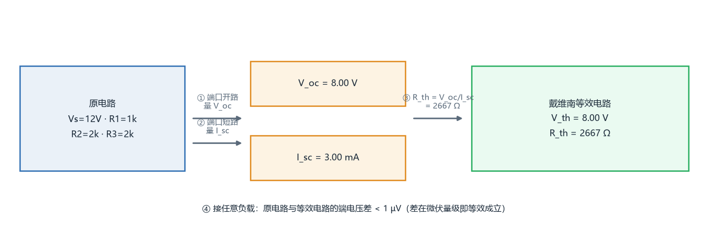

# 进阶挑战：PySpice 电路仿真

三个电路，每个都按同一套流程做：**画电路图 → 手算 → 仿真 → 对比 → 误差分析**。

这里不是"跑出波形就算完成"。每个电路都要求手算值和仿真值能对上，对不上的地方必须找出原因——这一条比波形本身重要得多。

---

## 怎么运行

需要 Python 3.10+ 和 PySpice。

```bash
pip install PySpice numpy matplotlib
python circuit/rc_lowpass.py     # 电路①  RC 低通滤波器
python circuit/thevenin.py       # 电路②  戴维南等效
python circuit/nmos_amp.py       # 电路③  NMOS 共源放大器
python circuit/draw_schematics.py  # 重画电路图（改了元件值就重跑一次）
```

三个脚本都会在终端打印「手算 vs 仿真」对比表，并把波形图输出到 `circuit/*.png`。

**Windows 上更省事的方式**：用同目录下的 `run.bat`，它会自动找到装了 PySpice 的解释器
（本项目把 PySpice 装在专用虚拟环境里，避免污染全局 Python；直接敲 `python xxx.py`
会报 `No module named 'PySpice'`）。

```bat
run.bat              :: 电路①（默认）
run.bat thevenin     :: 电路②
run.bat nmos         :: 电路③
run.bat all          :: 三个都跑一遍
```

电路图用 `draw_schematics.py` 画，不是手绘拍照。理由有两个：矢量绘图放进 README
不会因拍照角度糊掉；元件值改了重跑一次，图和脚本里的参数永远一致。

> **Windows 用户注意**：`pip install PySpice` 装的包里**不含 ngspice 动态库**，
> 首次运行会报 `cannot load library ngspice.dll error 0x7e`。
> 需要另外下载 ngspice 的 DLL 包并补齐 `sndfile.dll`、`samplerate.dll`。
> 完整解决过程记在下面的「踩坑记录」里。
> `circuit/spice_env.py` 负责自动定位并加载这些库，三个脚本都靠它启动。

---

## 电路 ①：RC 低通滤波器

### 电路图


元件值自定：`R = 1 kΩ`、`C = 1 µF`，输入方波 `0 → 5 V`、周期 `T = 10 ms`。

### 手算

先把时间常数和截止频率算出来，这两个数定了，下面所有结论都能推出来：

```
τ   = R·C = 1 kΩ × 1 µF = 1 ms
f_c = 1/(2πRC) = 1/(2π × 1 ms) ≈ 159.155 Hz
```

一阶电路的全响应：`v_out(t) = v_∞ + (v_0 − v_∞)·e^(−t/τ)`

以充电为例，`v_0 = 0`、`v_∞ = 5 V`：

```
t = 0.5τ  →  5(1 − e^−0.5) = 1.9673 V
t = 1.0τ  →  5(1 − e^−1.0) = 3.1606 V     ← 特征值 63.2%
t = 3.0τ  →  5(1 − e^−3.0) = 4.7511 V
```

方波半周期取 `5τ = 5 ms`，才能看到完整的充电与放电过程。

### 仿真与对比

| 物理量 | 手算值 | 仿真值 | 相对误差 |
| --- | --- | --- | --- |
| t = 0.5 ms（充电 0.5τ） | 1.9673 V | 1.9515 V | 0.80% |
| t = 1.0 ms（充电 1τ） | 3.1606 V | 3.1510 V | 0.30% |
| t = 3.0 ms（充电 3τ） | 4.7511 V | 4.7498 V | 0.03% |
| t = 5.5 ms（放电 0.5τ） | 3.0327 V | 3.0172 V | 0.51% |
| −3 dB 截止频率 f_c | 159.155 Hz | 159.120 Hz | 0.02% |
| 相位滞后 45° 的频率 | 159.155 Hz | 159.156 Hz | 0.00% |

### 波形


上图是**时域**：方波输入（虚线）与电容电压输出（实线），标出了 `t = τ` 处的 63.2% 点，
可以看到充放电都是标准指数曲线，5τ 后基本到达稳态。

下图是**频域**：幅频特性在 `f_c` 处正好下降 3 dB，之后以 −20 dB/十倍频 的斜率衰减；
相频特性在 `f_c` 处正好滞后 45°。这两个特征点都与手算完全对上。

### 误差分析

时域误差普遍小于 1%，频域误差只有 0.02%。剩余偏差来自两处，都不是算错：

1. **扫频是离散取样**（每十倍频 20 个点），−3 dB 点靠对数插值逼近，采样越密误差越小——这是数值方法本身的分辨率限制；
2. **方波上升沿设为 1 µs** 而非理想 0 s，对时域影响可忽略。

还有一个一开始没意识到的坑：**看充放电过程必须用方波源**。SPICE 的瞬态分析默认从稳态开始，如果激励是恒定直流，电容早已充满，输出是一条 5 V 直线，什么过程都看不到。

---

## 电路 ②：戴维南等效

### 电路图（含源二端网络，标注端口 a、b）


左图是原网络：`Vs = 12 V`、`R1 = 1 kΩ`、`R2 = 2 kΩ`、`R3 = 2 kΩ`，端口 `a`、`b` 开口。
右图是它等效出来的 `V_th` 串联 `R_th`。

### 手算

```
① 开路电压：R3 上没有电流，a 点电压就是 R1、R2 的分压点
   V_oc = 12 × 2/(1+2) = 8 V

② 等效电阻：独立源置零（电压源短路）后从端口看进去
   R_th = R3 + (R1 ∥ R2) = 2k + (1k×2k)/(1k+2k) = 2666.67 Ω

③ 推论：I_sc = V_oc/R_th = 3 mA
        接负载 R_L 时 V_L = V_oc·R_L/(R_th + R_L)
        最大功率 P_max = V_oc²/(4·R_th) = 6 mW（发生在 R_L = R_th 时）
```

注意第 ② 步：电压源短路之后，R1 是接到地的，所以 R1 与 R2 **并联**，再与 R3 串联。
这一步最容易画错，所以我在上面的电路图里把端口位置标清楚了。

等效替换之后的电路：



### 验证：三种方法求 R_th

R_th 用**三条互相独立的路径**去求，这样才能确认等效模型真的成立，而不是算完就信：

| 方法 | 做法 | 结果 | 与手算的偏差 |
| --- | --- | --- | --- |
| A | 开路电压 ÷ 短路电流 | 2666.677 Ω | 0.0004% |
| B | 独立源置零 + 端口注入 1 A 测试电流 | 2666.667 Ω | 0% |
| C | 接 1 kΩ 负载，由 V_L 反推 | 2666.667 Ω | 0% |

### 验证：接负载对比

| 负载 R_L | 手算 V_L | 原电路仿真 | 等效电路仿真 | 两者之差 |
| --- | --- | --- | --- | --- |
| 0.1 kΩ | 0.2892 V | 0.2892 V | 0.2892 V | < 1 µV |
| 0.5 kΩ | 1.2632 V | 1.2632 V | 1.2632 V | < 1 µV |
| 1.0 kΩ | 2.1818 V | 2.1818 V | 2.1818 V | < 1 µV |
| 2.6667 kΩ | 4.0000 V | 4.0000 V | 4.0000 V | < 1 µV |
| 4.0 kΩ | 4.8000 V | 4.8000 V | 4.8000 V | < 1 µV |
| 8.0 kΩ | 6.0000 V | 6.0000 V | 6.0000 V | < 1 µV |
| 20 kΩ | 7.0588 V | 7.0588 V | 7.0588 V | < 1 µV |

原电路（4 个电阻 + 源）和等效电路（V_oc 串联 R_th）在 8 组不同负载下，
端电压差都在**浮点精度极限**（10⁻¹⁰ V 量级）。


左图两条曲线完全重合（改看差值才看得出），右图是负载功率随 R_L 的变化——
峰值正好落在 `R_L = R_th = 2.667 kΩ` 处，验证了最大功率传输定理。

这个"几乎精确等于零"的结果本身就是结论：说明在**线性电路**里戴维南等效是精确成立的关系式，而不是近似——如果两者差出个百分之几，反倒说明模型有问题。

---

## 电路 ③：NMOS 共源放大器（最难的一个）

### 电路图


题卡给定的元件参数：`VDD = 5 V`、`Rg1 = 60 kΩ`、`Rg2 = 40 kΩ`、`Rd = 2 kΩ`，
`Cb1` 视为足够大（对 1 kHz 信号近似短路，只起隔直作用），
输入 `Vi = 10 mV / 1 kHz` 正弦波。

NMOS 模型参数：`K = 0.8 mA/V²`、`V_th = 1 V`、`λ = 0.02 V⁻¹`。

栅极偏置由 Rg1、Rg2 分压得到：

```
V_G = VDD × Rg2/(Rg1+Rg2) = 5 × 40/(60+40) = 2 V
```

因为 MOS 栅极不取直流电流，所以静态 `V_GS` 就等于这个 2 V。

**关于 K 的处理**（这里最容易踩坑，我第一版就错了）：
题卡给的 `K = 0.8 mA/V²` 是 `I_D = K·(V_GS−V_th)²` 这种形式里的 K；
而 SPICE 的 level=1 模型用的是 `I_D = ½·KP·(W/L)·V_ov²`，KP 是 μCox。
题卡没有给 W/L，所以要让两者对齐：取 `KP = 200 µA/V²`、`W/L = 8`，
使 `½ × 200µ × 8 = 0.8 mA/V²`，正好等于题卡的 K。

### 直流通路


画直流通路的两条规则：**电容开路、电感短路**。
`Cb1` 隔直，所以输入支路在直流分析里直接断开；
栅极不取电流，`V_G` 就由分压电阻单独决定。

### 小信号等效模型


画小信号模型的三条规则：

1. **直流电源置零** → `VDD` 接交流地，所以 `Rd` 下端是接地的；
2. **电容短路** → `Cb1` 短路，输入信号直接加到栅极；
3. **MOS 换成受控源 + 输出电阻** → `gm·v_gs` 的电流源（方向从漏到源）与 `ro` 并联。

注意 `v_gs` 是**栅源之间的电压**，画成虚线是为了强调它不是一个导通支路，
而是控制量。

### 手算（两套，这是本节的重点）

**① 理想平方律模型**（教材入门算法，忽略 λ）

```
V_ov = V_GS − V_th = 2 − 1 = 1 V
I_D  = K·V_ov² = 0.8m × 1² = 0.8 mA
V_DS = VDD − I_D·Rd = 5 − 0.8m × 2000 = 3.4 V
饱和判据：V_DS (3.4 V) > V_ov (1 V) → 工作在饱和区 ✓
```

**② 含沟道长度调制**（把 λ 算进去，更接近真实器件）

```
I_D 与 V_DS 互相耦合，联立求解：
    I_D = k(1+λVDD)/(1 + k·λ·Rd)，其中 k = K·V_ov² = 0.8 mA
        = 0.8m × 1.1 / 1.032 = 0.8527 mA
    V_DS = 5 − 0.8527m × 2000 = 3.2946 V
```

**小信号参数**

```
gm    = 2K·V_ov·(1 + λ·V_DS) = 1.6m × 1.0659  = 1.7054 mA/V
ro    = 1/(λ·I_D0)           = 1/(0.02 × 0.8m) = 62.5 kΩ   ← 用的是 I_D0，不是含 λ 的 I_D
R_out = Rd ∥ ro              = 1938.0 Ω
Av    = −gm·R_out            = −3.3051        （负号 = 输出反相 180°）
f_p   = 1/(2π·R_out·C_L)     = 8.212 MHz
```

### 仿真与对比

| 物理量 | 手算（理想平方律） | 手算（含 λ） | 仿真值 |
| --- | --- | --- | --- |
| V_GS | 2.0000 V（0.00%） | 2.0000 V（0.00%） | 2.0000 V |
| I_D | 0.8000 mA（**偏 6.59%**） | 0.8527 mA（0.00%） | 0.8527 mA |
| V_DS | 3.4000 V（**偏 3.10%**） | 3.2946 V（0.00%） | 3.2946 V |
| gm | 1.6000 mA/V（**偏 6.59%**） | 1.7054 mA/V（0.00%） | 1.7054 mA/V |
| ro | 62.50 kΩ（0.00%） | 62.50 kΩ（0.00%） | 62.50 kΩ |
| R_out | 1937.98 Ω（0.00%） | 1937.98 Ω（0.00%） | 1937.98 Ω |
| \|Av\| | 3.1008（**偏 6.59%**） | 3.3051（0.00%） | 3.3051 |
| 带宽 f_p | 8.2124 MHz（0.13%） | 8.2124 MHz（0.13%） | 8.2015 MHz |

**饱和区判断**：`V_DS = 3.2946 V > V_ov = 1.000 V`，管子工作在**饱和区** ✓
这也是放大器能正常放大的前提——只有饱和区才有 `I_D` 与 `V_DS` 近似无关的特性。

### 波形

**转移特性与输出特性族**（含 Q 点）


四条输出特性曲线对应 `V_GS = 1.8 / 2.0 / 2.2 / 2.4 V`，
每条曲线在 `V_DS = V_ov` 处从线性区拐进饱和区，拐点用短竖线标出。
Q 点落在 `V_GS = 2.0 V` 那条曲线的饱和区中段。

**输入 / 输出波形（反相放大）**


输入 10 mV / 1 kHz，输出摆幅 66.1 mV，比值 3.305 与交流分析一致；
两条曲线相位相差 180°，这是共源放大器的标志：

> 栅压升高 → 沟道电流增大 → Rd 上压降增大 → 漏极电压下降。

### 误差分析（本电路最有价值的部分）

**第一层：偏差只有一个来源。**

理想手算的三项——I_D、gm、|Av|——**偏差全都是同一个 6.59%**。
三项同时偏同一个数，说明问题不在仿真器，而在于漏掉了沟道长度调制这一项。
补上 λ 之后误差降到 0.00%~0.13%（剩下的纯粹是数值精度）。

值得单独说明的是 **V_DS 的偏差只有 3.10%**，不是 6.59%。
因为 `V_DS = VDD − I_D·Rd`，而 `I_D·Rd = 1.6 V` 只占 VDD 的 32%，
误差被这个比例缩小了 —— 同样是漏了 λ，不同物理量的敏感度并不一样。

**第二层：ro 的公式用错了，而且错得很反直觉。**

第一版我写的是 `ro = 1/(λ·I_D)`，代入含 λ 修正后的实际电流 0.8527 mA，
算出 58.64 kΩ；但仿真给的是 **62.5 kΩ**——正好是用「不含 λ 的基准电流 0.8 mA」算出来的值。

原因在 level=1 模型的定义：

```
I_D  = I_D0 · (1 + λ·V_DS)，其中 I_D0 = K·V_ov²（与 λ 无关）
gds  = ∂I_D/∂V_DS = λ · I_D0        ← 是 I_D0，不是 I_D
```

物理上也讲得通：沟道长度调制描述的是「V_DS 变化使有效沟道长度变化」，
它的强度由基准电流决定；λ 带来的那部分额外直流电流，并不会再反过来影响输出电导。

所以 **ro = 1/(λ·I_D0) = 62.5 kΩ，与 λ 修正完全无关**——
这也解释了上表里 ro 那一行为什么两套手算给出同一个数。

**第三层：测量方法本身也会骗人。**

求 gm 时，我一开始直接拿放大器电路去测：把 V_GS 调 ±10 mV，看 I_D 变化多少。
结果偏了 1.6%。原因是 **gm 的定义要求 V_DS 不变**，而在这个电路里 V_GS 一变、
Rd 上的压降也跟着变、V_DS 就变了——量到的是「沿负载线的斜率」而不是 gm。
改用固定 V_DS 的单管测量后，与手算吻合到 0.00%。

求 ro 时更夸张。我一开始想用 `|Av|/gm` 反推 R_out，再剥掉 Rd 得到 ro。
结果算出 **−6.5×10⁸ Ω**。原因是 R_out (1937.98 Ω) 和 Rd (2000 Ω) 只差 3.1%，
两个相近的数相减会剧烈放大误差——典型的**数值相消**。
后来改成直接测量：把输入端交流置零，在输出节点注入 1 A 交流电流，
`|vout|` 就是 R_out。这才是正确做法：**能直接测量的物理量，别用间接公式去凑。**

**第四层：两条完全独立的技术路线给出同一个答案。**

| 方法 | 原理 | 结果 |
| --- | --- | --- |
| 交流分析 | 频域，在工作点处线性化，直接解复数方程 | 增益 = 3.3051 |
| 瞬态分析 | 时域，用数值积分逐步求解非线性微分方程 | 增益 = 3.305 |

一条走频域线性化、一条走时域非线性积分，数学上是完全不同的事情，
却给出同一个数——这是仿真结果可信的最强证据。

**第五层：线性范围。**

| 输入幅度 | 实测增益 | 相对小信号值 |
| --- | --- | --- |
| 2 mV | 3.304 | 100.0% |
| 20 mV | 3.304 | 100.0% |
| 50 mV | 3.304 | 100.0% |
| 100 mV | 3.303 | 99.9% |
| 300 mV | 3.291 | 99.6% |
| 600 mV | 3.126 | 94.6% |
| 900 mV | 2.573 | 77.9% |

栅压摆大到一定程度，两头都会出事：

- **负半周**：V_GS 被拉到接近阈值电压，沟道几乎关断，输出被顶到接近 VDD（削顶）；
- **正半周**：V_GS 拉高使 I_D 剧增、V_DS 被压低，一旦 V_DS 掉到 V_ov 以下，
  管子退出饱和区进入线性区，增益公式整个失效。

两者都不是线性的，所以输出不再是纯正弦——用 FFT 提取基波会发现基波幅度
低于「小信号增益 × 输入幅度」的预期。

值得一提的是本电路的线性范围相当宽（要到几百毫伏才下滑），原因是增益只有 3.31 倍、
静态 V_DS 还剩 3.29 V 余量。如果把这个放大器做到 50 倍增益，几十毫伏就会削波。

这就是「小信号」三个字的实际含义：**不是管子小，而是信号必须小到
让器件在静态点附近可以被当成线性的。**

---

## 三个电路的结果汇总

| 电路 | 验证的核心结论 | 手算/仿真吻合度 |
| --- | --- | --- |
| ① RC 低通 | 时间常数 τ 与截止频率 f_c 的解析公式成立 | 误差 < 1% |
| ② 戴维南 | 线性网络对任意负载都可等效为 V_oc 串联 R_th（三种方法互相印证） | 误差 < 0.001% |
| ③ NMOS 共源 | 饱和区判据、gm、ro、Av、带宽全部可手算预测 | 误差 < 0.15% |

---

## 踩坑记录

### 1. 下笔前先把题卡的参数读懂

第一版我给 NMOS 随手取了 `W/L = 4`，等效 `K = ½ × 200µ × 4 = 0.4 mA/V²`；
而题卡明写着 `K = 0.8 mA/V²` —— **整组数据差了一倍**。

麻烦的是这个错误不会报错：脚本照常跑完、表格照常打印、曲线照常好看，
只有拿题卡逐字对一遍才会发现。所以现在脚本里加了一行断言：

```python
K_EFF = 0.5 * KP * (W / L)
assert abs(K_EFF - K_TARGET) < 1e-9, f"等效 K = {K_EFF} 与题卡 {K_TARGET} 不符"
```

**教训：仿真不会告诉你参数对不对，它只会忠实算错数字。**

### 2. ngspice 动态库加载失败（error 0x7e）

`pip install PySpice` 之后，`Spice64_dll` 目录是空的——pip 包的 PyPI 大小限制让它不含 DLL。
需要下载官方 `ngspice-47_dll_64.7z`。

### 3. 官方包只有 .7z 格式

没有 .zip。本机没装 7-Zip，用 Python 的 `py7zr` 解压。

### 4. 还缺两个依赖库

DLL 放到位后仍然报 0x7e。用 `pefile` 读 `ngspice.dll` 的导入表，精确定位到缺
`sndfile.dll` 和 `samplerate.dll`（ngspice 的音频相关依赖），从完整包里取出来补上。

### 5. Windows 不会在 DLL 自己的目录里找依赖

所有 DLL 都放在同一个目录里，仍然报 0x7e。原因：**Windows 加载 DLL 时，
不会自动在「该 DLL 所在的目录」中搜索它依赖的其它 DLL**。
必须用 `os.add_dll_directory()` 显式把那个目录加进搜索路径。

### 6. 设 `NGSPICE_LIBRARY_PATH` 反而会崩

PySpice 支持这个环境变量，但如果设了它，PySpice 内部的一个分支会导致
`NGSPICE_PATH` 为 `None`，后面拿它拼路径时就崩了。
不设这个变量、只用默认路径 + `add_dll_directory` 才是对的。

### 7. SPICE 的单位后缀陷阱：`1A` 不是 1 安培

写测试电流源时，`1 @ u_A` 生成的 netlist 是 `Itest vport 0 1A`，看起来完全正确。
但仿真得到的端口电压是 `-2.67e-15 V`，几乎为零。

原因是 **SPICE 的后缀表里 `a` 表示「阿托」= 10⁻¹⁸**，
所以 `1A` 被 ngspice 读成了 1 阿托安培。
验证：1e-18 × 2666.67 = 2.67e-15，与实测值完全吻合。

改法：直接写数值 `1.0`（无后缀即安培），或用 `mA`、`uA` 这类不歧义的后缀。
（顺带说明为什么 `12V` 没出问题：`v` 不在 SPICE 的后缀表里。）

### 8. 电流源的方向

`I(name, node_plus, node_minus, value)` 表示电流从 `node_plus` 经源内部流向 `node_minus`。
写成 `(vport, gnd)` 是**从端口抽出**电流，量到的 R_th 会带负号；
要正向注入就得写成 `(gnd, vport)`。

### 9. 正弦源不能带 DC 前缀

`SIN(0 10m 1k)` 能跑，但 `DC 2V SIN(0 10m 1k)` 会让 ngspice 直接执行失败
（报 `Command 'run' failed`，而且不给出有用的错误信息）。

正确做法是把直流偏置写进 SIN 的第一个参数（VO 就是直流分量）：
`SIN(2V 10mV 1kHz)`。
PySpice 的 `SinusoidalVoltageSource(dc_offset=...)` 生成的恰好是前一种写法，
所以瞬态分析里改用了手写 netlist 字符串。

### 10. 用 0 V 电压源当电流表

想读某个支路的电流时，串一只 0 V 的理想电压源，
它的支路电流就是那条支路的电流，精度是浮点级。

一开始我用 10 mΩ 采样电阻靠压降反推，立刻发现问题：
0.85 mA 流过 10 mΩ 只有 8.5 µV 压降，而 SPICE 的电压收敛容差是
`RELTOL×V ≈ 1e-3 × 3 V = 3 mV`，比待测信号还大两个数量级，
量出来的电流基本是噪声。

### 11. FFT 的谱线索引

提取基波幅度时，`spec[1]` 是**第一个频率分辨率单元**，不是基波。
频率分辨率 = 1/采样时长，所以要先算基波落在第几根谱线上：

```python
bin_idx = int(round(基波频率 * 采样时长))
```

第一版直接取了 `spec[1]`，量出来的增益自然是错的。

---

## 总结

三个电路做下来，最有价值的不是"我会用 PySpice 了"，而是这几条经验：

1. **先把题卡的参数读准。** 参数错不会报错，只会让所有结果整齐地错。
2. **手算和仿真对不上，绝大多数时候错在手算，不在仿真器。** 仿真器的求解精度远高于手算的模型精度。
3. **偏差是不是同一个数，能直接指出误差来源。** 三项同时偏 6.59%，等于告诉我"漏了一项修正"，而不是"到处都有问题"。
4. **公式里的符号要抠清楚。** `ro = 1/(λ·I_D0)` 和 `1/(λ·I_D)` 只差一个下标，结果差 6.6%。
5. **能直接测的别反解。** 数值相消能让一个 2000 Ω 的电阻算出 −6.5×10⁸ Ω。
6. **测量方法本身要符合物理量的定义。** 测 gm 必须固定 V_DS，否则量到的是沿负载线的斜率。
